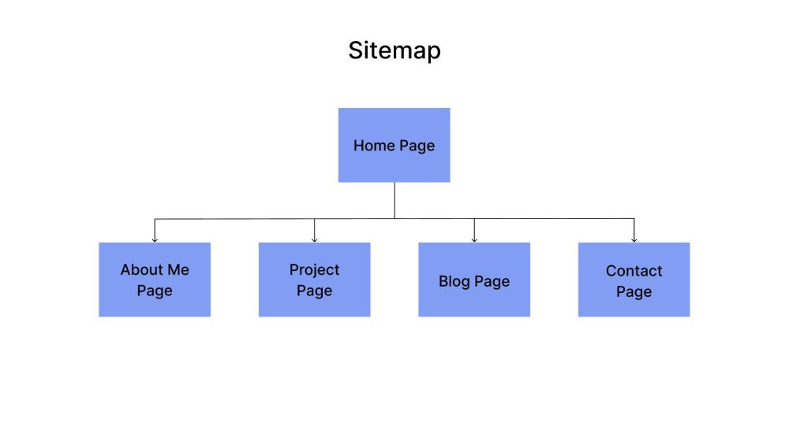
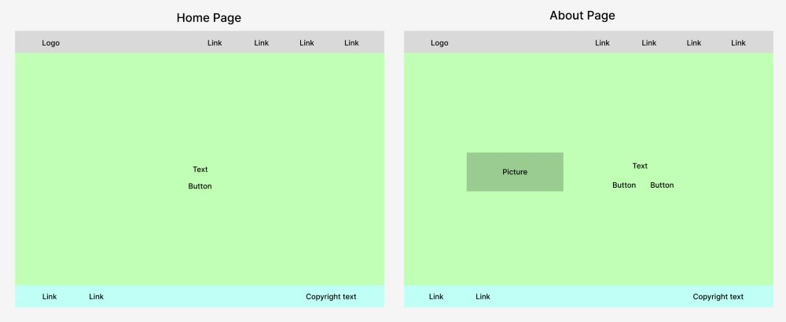
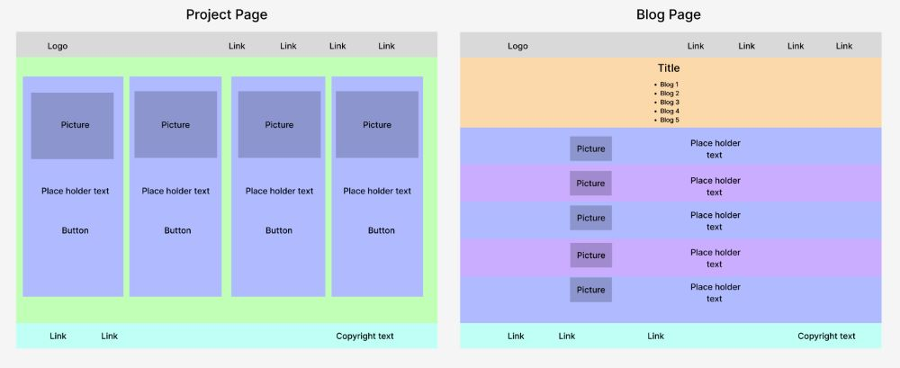
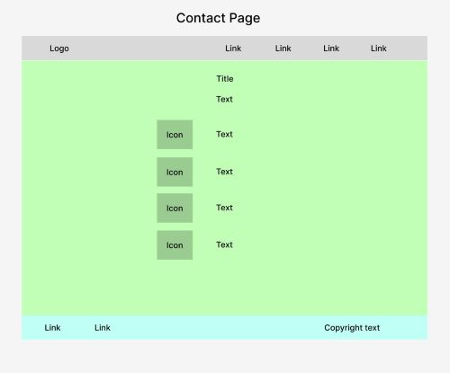
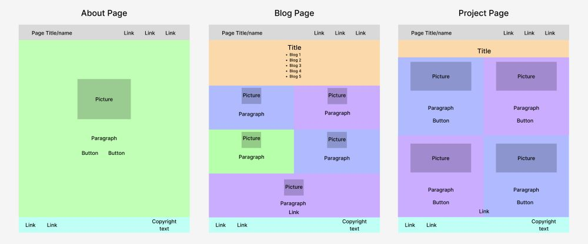
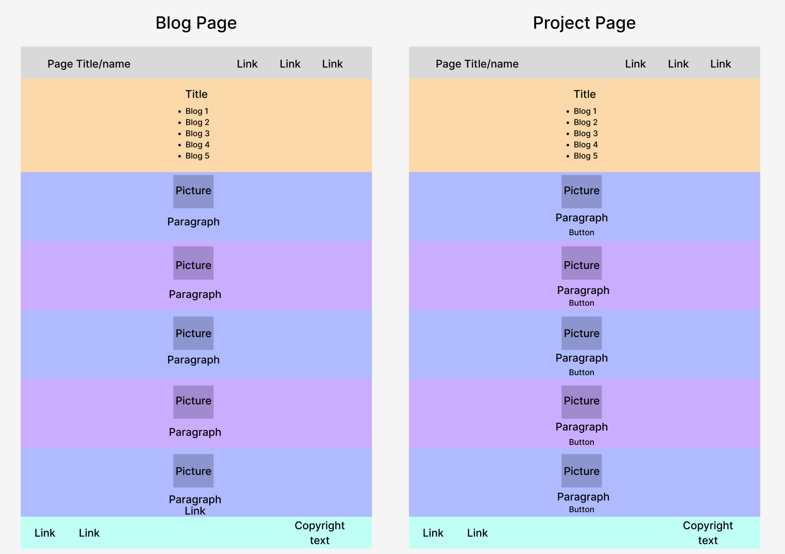

# T1A2 - David Nguyen #  
## Links ##  
* [GitHub Repo](https://github.com/dn-coding/DavidNguyen_T1A2)  
* [Figma Wireframe](https://www.figma.com/file/EG50EHP4VsPpB1KkByHSZh/T1A2?type=design&t=nBaXAmqjzQ8DZpQc-6)  
## Description ##  
  The purpose of my portfolio website is to demonstrate my abilities as a Novice Developer and I.T Professional showcasing information about myself, skills, interests, professional knowledge and projects. Though the blog and project pages are currently filled with placeholder content, my own future experiences and work will replace them in time.  

  My website has 5 HTML documents which are linked to 1 CSS file. These webpages have relevant information and a suitable design for users on phones, tablets and desktops.

  
  
  ### Sitemap ###

  The main page is the Home Page which can access all other pages via a navigation bar. This is also available to every page as the navigation bar has been created for each document. By doing so it gives the user a better, faster and simple experience when using the website.

    
  
  ### Wireframe Pages ### 
  
  With a simple design and my current skills, I have created a basic layout for mobile, tablet and desktop users for a better experience.  

  Appropriate font, image and CSS flexboxes have been made for each document:
  
  *  Increasing/decreasing the font and image sizes when viewing on certain devices will improve visbility and user experience. 
  *  Adjusting flexbox layouts on different breakpoints gives a better viewing experience as pages are not cluttered and content is not compressed.  
    
  For pages such as the Blog page where there is more content and the page is longer, links were created to help navigate with ease from top to blog post and back to the top when at the end of the page. 

  Components such as fonts, headings, buttons, containers and images have been styled and given properties such as borders, shadows, sizes, colours and spacing to engage the user.

  #### Desktop Users
    
    
    

  #### Tablet Users ####  
    
   

  #### Mobile Users ####  
    
  

  
**The target audience for my website are:**  
* **My Educators**  
  - Mark my assignment and see my progress.  
* **Future Employers**  
  - Gain interest in my skills, work and personality and hopefully given potential job offers.  
* **Myself**  
  - Use as a beginning point to look back on as I further learn and improve.  
    
**The tech stack I have used:**    
* HTML  
* CSS  
* Wireframe
* Git (Version Control System)  